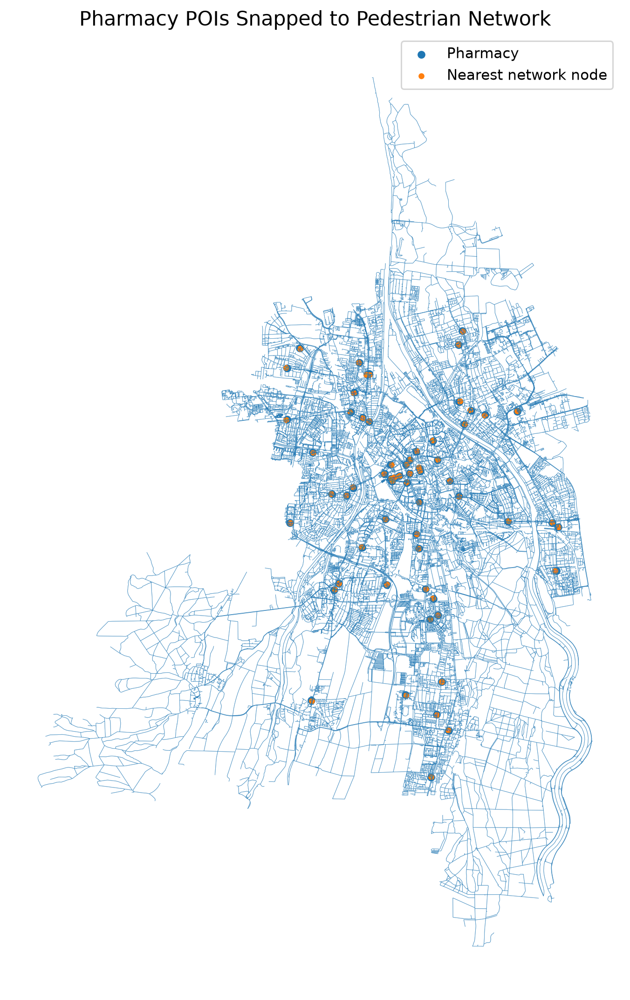
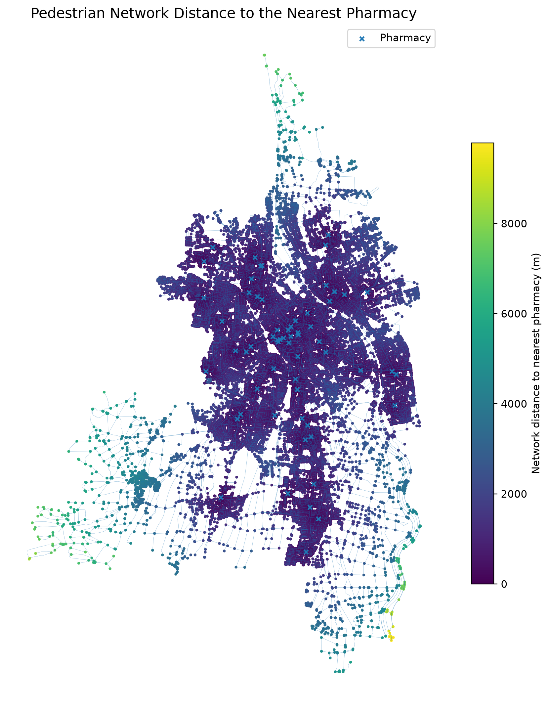
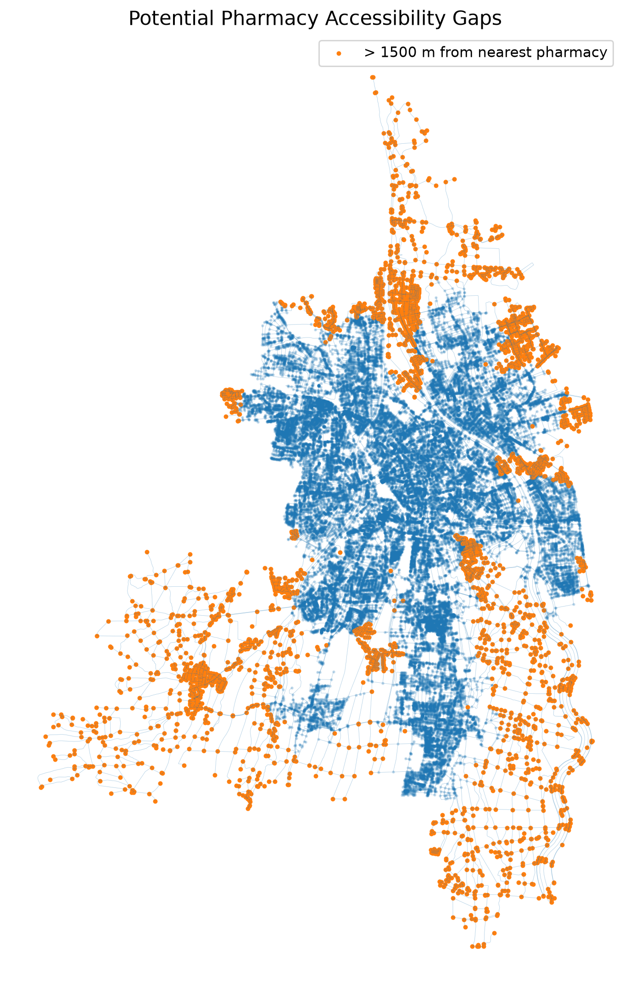
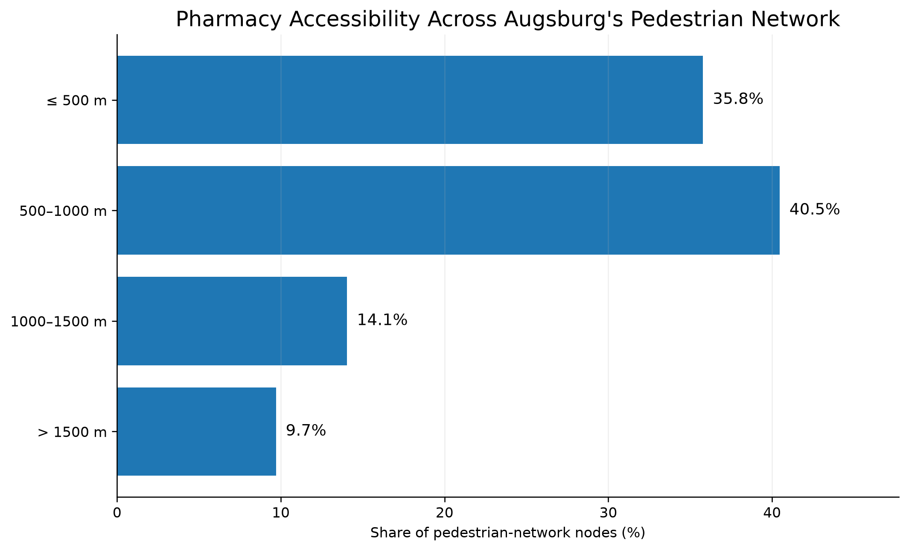

# Urban Accessibility Analysis: Pedestrian Access to Pharmacies in Augsburg

## Overview

This project examines how easily pharmacies can be reached through Augsburg's pedestrian street network. Instead of using straight-line distance, accessibility is measured along the walkable network so that the analysis reflects the structure of actual pedestrian routes.

The project was designed as a reproducible GIS workflow. OpenStreetMap data are retrieved and processed automatically through GitHub Actions, while lightweight analytical outputs are written back to the repository for inspection and presentation.

## Research question

**How accessible are pharmacies across Augsburg when accessibility is measured through the pedestrian network rather than straight-line distance?**

## Why network distance?

Euclidean distance can underestimate the effort required to reach a destination because it ignores the structure of the street network and physical barriers. This project therefore represents pedestrian space as a graph:

- **nodes** represent locations within the pedestrian network;
- **edges** represent walkable network segments;
- **pharmacy POIs** are matched to their nearest pedestrian-network nodes.

Shortest-path distance is then calculated through the network.

## Workflow

1. Retrieve the Augsburg pedestrian network from OpenStreetMap.
2. Retrieve pharmacy POIs.
3. Inspect the network and POI data.
4. Snap pharmacy locations to their nearest pedestrian-network nodes.
5. Calculate the shortest network distance from every reachable node to the nearest pharmacy using multi-source Dijkstra.
6. Classify network nodes into interpretable accessibility bands.
7. Identify potential low-accessibility areas and prepare portfolio outputs.

## Data and tools

**Data source:** OpenStreetMap

**Python stack:** OSMnx, GeoPandas, NetworkX, pandas, Matplotlib

**Automation:** GitHub Actions

The analysis uses the OpenStreetMap pedestrian network for Augsburg and pharmacy features tagged as `amenity=pharmacy`.

## Data validation and network matching

The workflow retrieved:

- **55,750 pedestrian-network nodes**
- **139,362 pedestrian-network edges**
- **62 pharmacy features**

The 62 pharmacies were matched to **61 unique network nodes**. The mean snapping distance was **13.20 m**, the median was **12.58 m**, and the maximum was **30.06 m**. These short distances indicate that the POIs were generally well aligned with the pedestrian network.



## Network accessibility

For each reachable pedestrian-network node, the workflow calculates the shortest walking-network distance to the nearest pharmacy. Multi-source Dijkstra is used so that all pharmacy nodes act as destinations within a single network-distance calculation.

The main descriptive results are:

| Metric | Result |
|---|---:|
| Mean network distance | 819.36 m |
| Median network distance | 649.64 m |
| 90th percentile | 1,476.81 m |
| Nodes within 500 m | 35.78% |
| Nodes within 1,000 m | 76.25% |
| Nodes within 1,500 m | 90.30% |



## Accessibility gaps

For exploratory screening, nodes more than **1,500 m** from the nearest pharmacy are treated as potential accessibility gaps. This threshold is close to the observed 90th percentile of the network-distance distribution and is used as an operational classification threshold rather than a universal planning standard.

Approximately **9.70%** of pedestrian-network nodes fall beyond this threshold. The mapped pattern shows that these nodes are concentrated mainly around the urban periphery and network edges, whereas the inner urban area generally has shorter network distances to pharmacies.



The distribution across the four accessibility bands is summarized below.



## Interpretation

Overall, **76.24%** of pedestrian-network nodes are within 1,000 m network distance of a pharmacy. The analysis also identifies a smaller set of peripheral network locations with substantially longer access distances.

These results should be interpreted as **network-based spatial accessibility**, not population accessibility. Every pedestrian-network node contributes to the analysis regardless of whether people live nearby. Peripheral roads and low-density areas can therefore influence the upper tail of the distance distribution.

The maximum observed network distance is consequently not interpreted as the walking distance experienced by a typical resident.

## Limitations

This project measures proximity to the nearest pharmacy through the pedestrian network. It does not incorporate residential population, pharmacy capacity, opening hours, individual mobility constraints, or variation in pedestrian travel speed.

The OpenStreetMap network and pharmacy POIs also reflect the completeness and currency of volunteered geographic information at the time the workflow is run.

A population-weighted accessibility analysis would require demand-side data and would answer a different question.

## Repository structure

```text
.
├── .github/
│   └── workflows/
│       └── run_analysis.yml
├── src/
│   ├── 01_download_data.py
│   ├── 02_check_data.py
│   ├── 03_snap_pharmacies.py
│   ├── 04_network_accessibility.py
│   ├── 05_accessibility_gaps.py
│   └── 06_portfolio_visuals.py
├── data/
├── outputs/
├── results/
├── requirements.txt
└── README.md
```

Large intermediate GIS files are generated during the GitHub Actions run rather than stored permanently in the repository. Lightweight summaries, tables, and figures are committed to `results/`.

## Reproducibility

The complete workflow can be run manually from the repository's **Actions** tab. Each run retrieves current OpenStreetMap data, performs the analysis, and updates the lightweight results stored in the repository.
